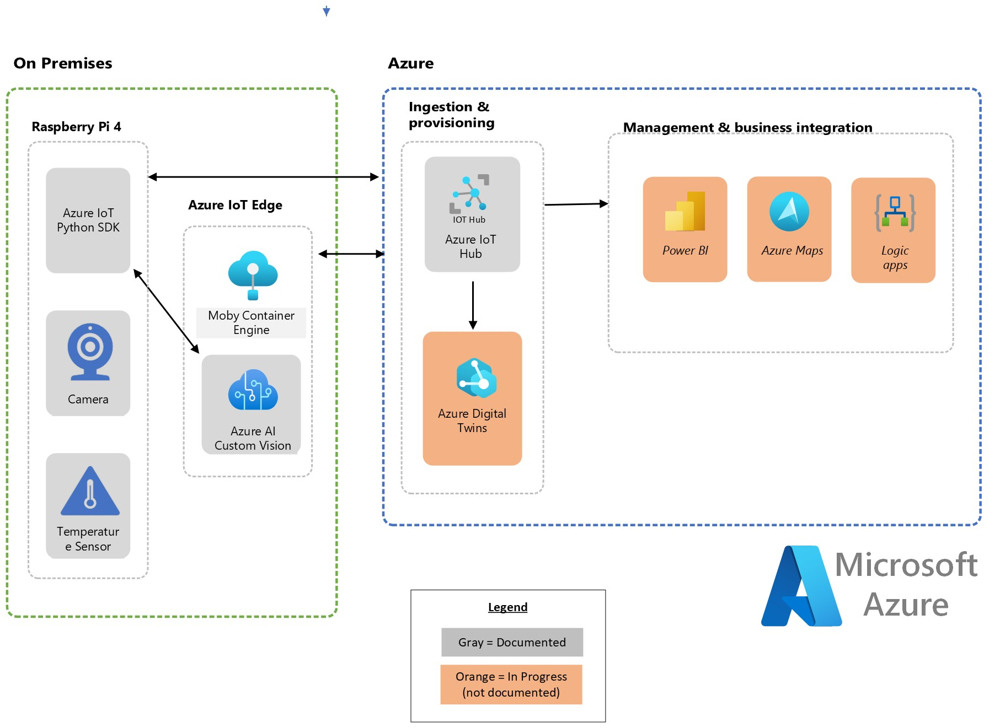

# Welcome to this Github Repo azureiotpyvision

## In this repo you will find a Python code that can used in your Raspberry Pi to build an Intelligent Vision solution with Azure IoT and Azure Custom Vision Cognitive Services to send telemetry to Azure Iothub

## Along with the python code, in this repo you will find the Hardware settings and the Azure Components been used to successfully execute the application. At this point, this is no a step by step guide, the main point is for you to get and understand the Python code used to develop the solution.

## Guide information

### Reference architecture

### Hardware - Vision components

* [Raspberry Pi model 4](https://www.raspberrypi.com/products/raspberry-pi-4-model-b/)
* [Grove Base Hat for Raspberry Pi](https://www.seeedstudio.com/Grove-Base-Hat-for-Raspberry-Pi.html)
* [Grove - Temperature & Humidity Sensor (DHT11)](https://www.seeedstudio.com/Grove-Temperature-Humidity-Sensor-DHT11.html)
* [Raspberry Pi High Quality Camera](https://www.raspberrypi.com/products/raspberry-pi-high-quality-camera/)
* [Arducam CS-Mount Lens for Raspberry Pi HQ Camera](https://www.arducam.com/product/arducam-cs-mount-lens-for-raspberry-pi-hq-camera-8mm-focal-length-with-manual-focus-and-adjustable-aperture/)

### Local Environment requirements

* Internet connectivity
* [Visual Studio Code](https://code.visualstudio.com/)
* [Python version 3](https://www.python.org/downloads/)
* [Hypervisor - In my case I was using my own laptop with Windows 11 and I enabled Hyper-V](https://learn.microsoft.com/en-us/virtualization/hyper-v-on-windows/quick-start/enable-hyper-v)
* [A virtual machine with IoT Edge](https://learn.microsoft.com/en-us/azure/iot-edge/about-iot-edge?view=iotedge-1.4)
  * [A docker container with Azure Custom Vision](https://learn.microsoft.com/en-us/azure/cognitive-services/custom-vision-service/overview)

### Azure requirements

* [An Azure subscription with administrative access](https://azure.microsoft.com/en-in/free/)
* [Azure Iothub](https://learn.microsoft.com/en-us/azure/iot-hub/iot-concepts-and-iot-hub)
* [Azure Custom Vision](https://learn.microsoft.com/en-us/azure/cognitive-services/custom-vision-service/overview)

### Environment set up - You might use the following links in case you want to recreate the solution

* [Connection and configuration of the Raspberry Pi](https://github.com/microsoft/IoT-For-Beginners/blob/main/1-getting-started/lessons/1-introduction-to-iot/pi.md)
* Connect the Camera to the Raspberry Pi
  * [Text Instructions](https://github.com/microsoft/IoT-For-Beginners/blob/main/4-manufacturing/lessons/2-check-fruit-from-device/pi-camera.md)
  * [Video Instructions](https://www.youtube.com/live/bBDbRD5XeVI?feature=share)
* [Create an Azure Iothub service](https://learn.microsoft.com/en-us/azure/iot-hub/iot-hub-create-through-portal)
* [Create a Azure Custom Vision service and train the model](https://learn.microsoft.com/en-us/windows/ai/windows-ml/tutorials/image-classification-train-model)
  * You can train Azure Custom Vision to interpret whatever figure you want. In my example I am training the service to interpret a "lighter".
* [Create an Iotedge device and deploy a Custom Vision model container](https://learn.microsoft.com/en-us/azure/iot-edge/tutorial-deploy-custom-vision?view=iotedge-1.4)
  * In my environment, the Iot Edge was created in a Linux VM inside Hyper-V

### Application Code

* [The code is located in "code/raspbpi-customvision-app.py"](https://github.com/pradorodriguez/azureiotpyvision/blob/master/code/raspbpi-customvision-app.py)

### Python Libraries

* [picamera](https://pypi.org/project/picamera/)
* [seeed_dht](https://pypi.org/project/seeed-python-dht/)
* [requests](https://pypi.org/project/requests/)
* [matplotlib](https://matplotlib.org/stable/users/installing/index.html/)
* [Pillow](https://pypi.org/project/Pillow/)
* [Numpy](https://numpy.org/install/)
* [azure-iot-device](https://pypi.org/project/azure-iot-device/)

### Application Notes

* The application must run inside the Raspberry Pi
* The Raspberry Pi must install previous Python Libraries
* The Raspberry Pi must have Python3

### Application main functions and methods

* **Main Function:**
  * Camera Initialization.
  * Temperature Sensor Initialization.
  * Connection establishment to Azure Iothub.
  * Calls multiple method to capture image in case the environment method is above 32 Celsius.
  * It sends a JSON object with the temperature and custom vision information to Azure IoThub.

* **CaptureImage Function:**
  * Takes a picture using the camera.

* **CustomVisionQuery Function:**
  * Sends the picture taken by the CaptureImage function to the Custom Vision Container in Iotedge (this IoT Edge is reacheable using a private IP).
  * Saves the JSON response from the Custom Vision container to a variable.

* **DetectedObjects Function:**
  * Creates an image with lines around each detected object from the Custom Vision container with a probability above 70%.
  * The position of the lines are determined by bounding box coordinates from the Custom Vision Container.
  * With the detect object coordinates, it creates a new image with lines around each detected object.
  * The image is saved locally in the Raspberry Pi.

* **MergeVisionTemperature Function:**
  * Creates a Dictonary variable IF temperature is higher than 32Celsius and Custom Vision Probability result is higher than 70%.
  * The Dictonary variable is used to create a JSON object